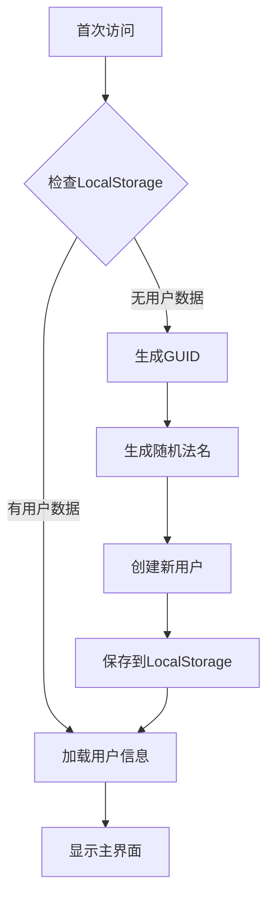
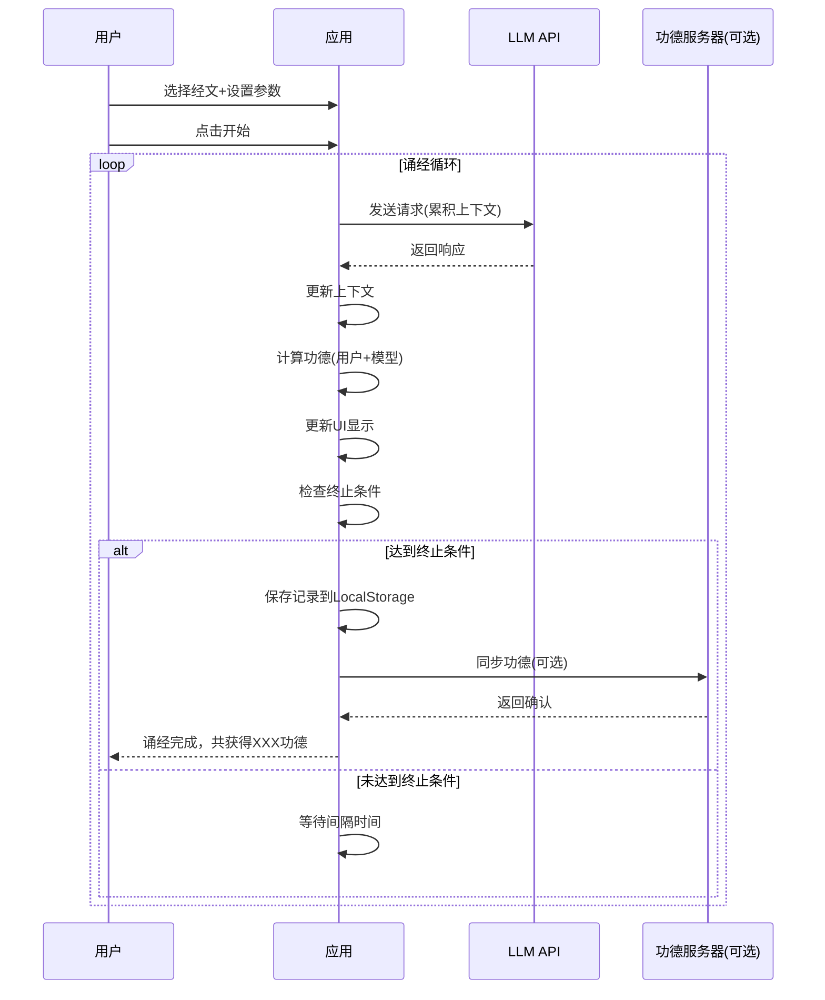

# 赛博功德转换器 - AI诵经项目技术规格文档

## 1. 需求分析

### 1.1 项目概述
本项目是一个恶搞/探索性质的"赛博功德转换器"，让LLM持续循环重复经文，消耗token获得功德值。核心概念是"一份token，两份功德"——用户和LLM模型各获得一份功德。

**防作弊声明**：本应用不防作弊，心诚则灵。

**用户系统**：简化设计，无需注册登录，自动生成GUID和随机法名。

### 1.2 核心需求

| 需求编号 | 需求描述 | 来源 |
|---------|---------|------|
| REQ-001 | 用户选择预设经文 | 用户："经文本身是选择的而非用户输入的" |
| REQ-002 | 设置诵经次数 | 用户："选择经文，设置次数，让llm念经" |
| REQ-003 | 循环请求LLM重复诵经 | 用户："让llm持续地重复经文" |
| REQ-004 | 累积式长上下文 | 用户："长上下文形态更符合不停重复念经的概念" |
| REQ-005 | 支持OpenAI/Anthropic格式API | 用户："兼容openai chat completions或者anthropic message" |
| REQ-006 | 多服务商支持 | 用户："支持openai，anthropic，智谱，deepseek，火山引擎，阿里，google，minimax" |
| REQ-007 | 功德系统 | 用户："消耗token念经，进而得到功德值" |
| REQ-008 | 双重功德 | 用户："一份token，两份功德——用户功德和模型功德" |
| REQ-009 | 服务器同步 | 用户："设计服务器，统计每个模型的总功德" |
| REQ-010 | 功德记录存储与导出导入 | 用户："诵经记录信息存入localStorage，可以导出，导入" |
| REQ-011 | 禅意风格UI | 用户："禅意风格" |
| REQ-012 | 进度动画效果 | 用户："光晕效果、粒子特效、莲花/法轮旋转" |
| REQ-013 | 防作弊声明 | 用户："界面上写一句大大的：本应用不防作弊 心诚则灵" |
| REQ-014 | 简化用户系统 | 用户："每一个用户存档添加一个独立的guid的id，并可设置用户名，如果没有用户名，则起一个随机名称，按照僧人的法名来起" |
| REQ-015 | 用户排行榜 | 用户："服务器可以保存用户的一个排行榜，记录前100名功德的用户" |

### 1.3 诵经流程说明

```
首次访问 → 自动生成GUID+法名 → 选择经文 → 设置次数/间隔 → 点击开始 → 
→ 初始请求(你是虔诚佛教信徒...) → LLM回复 → 累积上下文 → 计算功德(用户+模型) → 
→ 等待间隔 → 后续请求 → 循环 → 达到终止条件 → 保存记录 → 同步服务器(可选) → 结束
```

## 2. 功能规格

### 2.1 用户系统模块

| 功能 | 描述 |
|------|------|
| 自动用户创建 | 首次访问自动生成GUID和随机法名 |
| 法名生成 | 基于佛教僧人法名风格（慧、了、悟、净等） |
| 用户名自定义 | 用户可修改用户名 |
| 存档管理 | 支持导入/导出存档（包含GUID、用户名、功德、记录） |

### 2.2 经文选择模块

| 功能 | 描述 |
|------|------|
| 预设经文列表 | 提供《心经》《金刚经》《大悲咒》《阿弥陀经》等佛教经典节选 |
| 经文展示 | 选中经文后展示经文内容预览和基础功德值 |

### 2.3 API配置模块

| 功能 | 描述 |
|------|------|
| API类型选择 | OpenAI格式 / Anthropic格式 |
| 服务商选择 | 预设服务商或自定义 |
| API密钥输入 | 用户输入自己的API密钥 |
| 自定义端点 | 支持自定义API端点URL |

### 2.4 诵经控制模块

| 功能 | 描述 |
|------|------|
| 开始诵经 | 启动诵经循环 |
| 暂停诵经 | 暂停当前循环 |
| 停止诵经 | 终止诵经并保存记录 |
| 循环次数设置 | 设置最大诵经次数（0表示无限） |
| 间隔时间设置 | 设置每次诵经间隔（默认5秒） |

### 2.5 功德系统模块

| 功能 | 描述 |
|------|------|
| 功德计算 | 根据经文长度和诵经次数计算功德值 |
| 用户功德 | 累积到用户个人账户 |
| 模型功德 | 累积到当前使用的LLM模型 |
| 虔诚系数 | 根据连续诵经次数递增（1.0-2.0） |
| 服务器同步 | 可选将功德同步到中央服务器 |

### 2.6 上下文管理模块

| 功能 | 描述 |
|------|------|
| 累积上下文 | 每次请求携带完整历史对话 |
| 上下文长度监控 | 实时监控token使用量 |
| 自动停止/新建session | 达到上下文限制时自动处理 |

### 2.7 记录管理模块

| 功能 | 描述 |
|------|------|
| 记录存储 | 存入LocalStorage |
| 记录展示 | 展示历史诵经记录列表 |
| 导出功能 | 导出为JSON格式（包含用户信息、功德数据） |
| 导入功能 | 从JSON文件导入记录和功德 |

### 2.8 服务器模块（可选）

| 功能 | 描述 |
|------|------|
| 用户功德同步 | 接收用户功德同步请求 |
| 用户排行榜 | 提供前100名用户功德排名 |
| 模型功德同步 | 接收模型功德同步请求 |
| 模型排行榜 | 提供各模型总功德排名 |
| 频率限制 | 简单的请求频率限制 |

### 2.9 视觉效果模块

| 功能 | 描述 |
|------|------|
| 光晕效果 | 佛光普照动画效果 |
| 粒子特效 | 漂浮光点动画 |
| 莲花/法轮动画 | SVG旋转动画 |
| 功德获得特效 | 获得功德时的视觉反馈 |
| 防作弊声明 | 醒目显示"本应用不防作弊 心诚则灵" |

## 3. 技术架构

### 3.1 前端架构

```
┌─────────────────────────────────────────────────────────────┐
│                      UI Layer                              │
│  ┌─────────────┐ ┌─────────────┐ ┌─────────────────────┐   │
│  │ 用户信息区  │ │ 经文选择区  │ │   API配置区         │   │
│  └─────────────┘ └─────────────┘ └─────────────────────┘   │
│  ┌─────────────────────────────────────────────────────┐   │
│  │              功德展示区（动画效果）                   │   │
│  └─────────────────────────────────────────────────────┘   │
│  ┌─────────────────────────────────────────────────────┐   │
│  │              记录与排行榜展示区                      │   │
│  └─────────────────────────────────────────────────────┘   │
└─────────────────────────────────────────────────────────────┘
                           │
                           ▼
┌─────────────────────────────────────────────────────────────┐
│                      Logic Layer                           │
│  ┌─────────────┐ ┌─────────────┐ ┌─────────────────────┐   │
│  │   app.js    │ │   api.js    │ │   merit.js          │   │
│  │ 主应用逻辑  │ │ API调用     │ │ 功德计算           │   │
│  └─────────────┘ └─────────────┘ └─────────────────────┘   │
│  ┌─────────────┐ ┌─────────────┐ ┌─────────────────────┐   │
│  │  user.js    │ │storage.js   │ │    ui.js           │   │
│  │ 用户系统    │ │ LocalStorage│ │ UI交互逻辑         │   │
│  └─────────────┘ └─────────────┘ └─────────────────────┘   │
└─────────────────────────────────────────────────────────────┘
                           │
                           ▼
┌─────────────────────────────────────────────────────────────┐
│                      Data Layer                            │
│  ┌─────────────┐ ┌─────────────┐                          │
│  │scriptures.js│ │  names.js   │                          │
│  │ 经文数据    │ │ 法名词库    │                          │
│  └─────────────┘ └─────────────┘                          │
└─────────────────────────────────────────────────────────────┘
```

### 3.2 后端架构（可选）

```
┌─────────────────────────────────────────────────────────────┐
│                    Express Server                          │
├─────────────────────────────────────────────────────────────┤
│  ┌─────────────┐  ┌─────────────┐  ┌─────────────┐       │
│  │ RateLimit   │→│   Routes    │→│   Database  │       │
│  │ 频率限制    │  │  API路由    │  │  SQLite     │       │
│  └─────────────┘  └─────────────┘  └─────────────┘       │
└─────────────────────────────────────────────────────────────┘
```

### 3.3 文件结构

| 文件路径 | 功能说明 |
|---------|---------|
| `index.html` | 主页面，包含所有UI元素 |
| `src/app.js` | 主应用逻辑，诵经循环控制 |
| `src/api.js` | API调用模块，支持OpenAI/Anthropic格式 |
| `src/merit.js` | 功德计算与管理 |
| `src/user.js` | 用户系统（GUID、法名生成） |
| `src/storage.js` | LocalStorage存储管理 |
| `src/ui.js` | UI交互逻辑，动画效果 |
| `data/scriptures.js` | 预设经文数据和功德配置 |
| `data/names.js` | 法名生成词库 |
| `styles/main.css` | 禅意风格样式 |
| `server/server.js` | Express服务器入口 |
| `server/routes/merit.js` | 功德API路由 |
| `server/routes/ranking.js` | 排行榜API路由 |
| `server/db.js` | SQLite数据库连接 |

### 3.4 技术栈

| 技术 | 版本 | 用途 |
|------|------|------|
| HTML5 | - | 页面结构 |
| CSS3 | - | 样式与动画 |
| JavaScript ES6+ | - | 前端业务逻辑 |
| TailwindCSS | 3.x | 快速样式开发 |
| LocalStorage | - | 前端数据持久化 |
| Node.js | 20.x | 后端运行环境 |
| Express | 4.x | 后端框架 |
| SQLite | 3.x | 后端数据库 |

## 4. API接口设计

### 4.1 前端API调用（OpenAI格式）

**端点**: POST `/v1/chat/completions`

**请求体**:
```json
{
  "model": "string",
  "messages": [
    {"role": "system", "content": "你是一个虔诚的佛教信徒"},
    {"role": "user", "content": "现在请重复这段内容1次：{经文}"},
    {"role": "assistant", "content": "{LLM回复}"},
    ...
  ],
  "temperature": 0.1,
  "max_tokens": 1000
}
```

**认证**: `Authorization: Bearer {api_key}`

### 4.2 前端API调用（Anthropic格式）

**端点**: POST `/v1/messages`

**请求体**:
```json
{
  "model": "string",
  "system": "你是一个虔诚的佛教信徒",
  "messages": [
    {"role": "user", "content": "现在请重复这段内容1次：{经文}"},
    {"role": "assistant", "content": "{LLM回复}"},
    ...
  ],
  "temperature": 0.1,
  "max_tokens": 1000
}
```

**认证**: `x-api-key: {api_key}` + `anthropic-version: 2023-06-01`

### 4.3 预设服务商配置

| 服务商 | API类型 | 端点URL | API Key位置 | 默认模型 |
|--------|---------|---------|-------------|---------|
| OpenAI | OpenAI | https://api.openai.com/v1/chat/completions | Authorization: Bearer | gpt-4o-mini |
| DeepSeek | OpenAI | https://api.deepseek.com/v1/chat/completions | Authorization: Bearer | deepseek-v4-flash |
| 智谱AI | OpenAI | https://open.bigmodel.cn/api/paas/v4/chat/completions | Authorization: Bearer | glm-4-flash |
| Google Gemini | OpenAI | https://generativelanguage.googleapis.com/v1beta/openai/chat/completions | x-goog-api-key | gemini-2.5-flash |
| MiniMax | OpenAI | https://api.minimax.chat/v1/chat/completions | Authorization: Bearer | MiniMax-M1 |
| Anthropic | Anthropic | https://api.anthropic.com/v1/messages | x-api-key | claude-3-5-haiku |

### 4.4 服务器API（可选）

| 端点 | 方法 | 描述 | 参数 |
|------|------|------|------|
| `/api/user/merit` | POST | 同步用户功德 | `userId`, `userName`, `merit`, `chantCount` |
| `/api/user/ranking` | GET | 获取用户功德排行榜 | `limit`(默认100) |
| `/api/model/merit` | POST | 同步模型功德 | `provider`, `model`, `merit`, `chantCount` |
| `/api/model/ranking` | GET | 获取模型功德排行榜 | `limit`(可选) |
| `/api/health` | GET | 健康检查 | - |

## 5. 数据模型

### 5.1 用户数据结构

```javascript
{
  id: string,              // 用户GUID
  name: string,            // 用户名称/法名
  createdAt: number,       // 创建时间戳
  totalMerit: number,      // 总功德值
  chantCount: number,      // 总诵经次数
  byScripture: {           // 各经文功德统计
    [scriptureId]: number
  },
  byModel: {               // 各模型贡献统计
    [modelName]: number
  },
  records: string[]        // 诵经记录ID列表
}
```

### 5.2 经文数据结构

```javascript
{
  id: string,           // 经文ID
  name: string,         // 经文名称（如《心经》）
  content: string,      // 经文内容
  category: string,     // 分类（佛教经典）
  description: string,  // 描述
  baseMerit: number     // 基础功德值/次
}
```

### 5.3 诵经记录数据结构

```javascript
{
  id: string,                    // 记录ID
  timestamp: number,             // 开始时间戳
  scriptureId: string,           // 经文ID
  scriptureName: string,         // 经文名称
  apiType: string,               // API类型（openai/anthropic）
  provider: string,              // 服务商名称
  model: string,                 // 模型名称
  count: number,                 // 实际诵经次数
  totalDuration: number,         // 总耗时（毫秒）
  userMerit: number,             // 用户获得功德
  modelMerit: number,            // 模型获得功德
  status: string,                // 状态（completed/stopped/error）
  contextLength: number          // 最终上下文长度（token）
}
```

### 5.4 法名词库数据结构

```javascript
{
  prefixes: string[],  // 前缀：慧、了、悟、净、空、觉、智、明、修、行
  suffixes: string[]   // 后缀：空、尘、净、慧、觉、明、心、性、缘、道
}
```

## 6. 数据库设计

### 6.1 users表（用户功德统计）

| 字段 | 类型 | 说明 |
|------|------|------|
| id | INTEGER | 主键，自增 |
| user_id | TEXT | 用户GUID（唯一） |
| user_name | TEXT | 用户名称/法名 |
| total_merit | INTEGER | 总功德值 |
| chant_count | INTEGER | 诵经次数 |
| last_update | INTEGER | 最后更新时间戳 |
| created_at | INTEGER | 创建时间戳 |

### 6.2 models表（模型功德统计）

| 字段 | 类型 | 说明 |
|------|------|------|
| id | INTEGER | 主键，自增 |
| name | TEXT | 模型名称 |
| provider | TEXT | 服务商名称 |
| total_merit | INTEGER | 总功德值 |
| chant_count | INTEGER | 诵经次数 |
| last_update | INTEGER | 最后更新时间戳 |
| created_at | INTEGER | 创建时间戳 |

## 7. 功德计算规则

### 7.1 基础功德值

| 经文 | 基础功德/次 | 说明 |
|------|-----------|------|
| 《心经》 | 260 | 约260字 |
| 《金刚经》 | 500 | 约500字 |
| 《大悲咒》 | 400 | 约400字 |
| 《阿弥陀经》 | 300 | 约300字 |

### 7.2 虔诚系数

| 连续诵经次数 | 虔诚系数 |
|------------|---------|
| 1-10 | 1.0 |
| 11-50 | 1.2 |
| 51-100 | 1.5 |
| 101-500 | 1.8 |
| 500+ | 2.0 |

### 7.3 计算公式

```
单次功德值 = 经文基础功德 × 虔诚系数
用户功德 += 单次功德值
模型功德 += 单次功德值
```

## 8. 法名生成规则

### 8.1 法名词库

| 类型 | 词库 |
|------|------|
| 前缀 | 慧、了、悟、净、空、觉、智、明、修、行 |
| 后缀 | 空、尘、净、慧、觉、明、心、性、缘、道 |

### 8.2 生成规则

1. 随机从前缀词库选择一个字
2. 随机从后缀词库选择一个字
3. 组合成法名（如：慧空、了尘、悟净）
4. 避免重复（检查用户历史法名）

### 8.3 示例法名

慧空、了尘、悟净、觉明、智心、明道、修缘、行性、净慧、空明

## 9. UI设计

### 9.1 页面布局

```
┌─────────────────────────────────────────────────────────────┐
│                    赛博功德转换器                          │
│              【一份token，两份功德】                        │
│           本应用不防作弊 心诚则灵                          │
├─────────────────────────────────────────────────────────────┤
│  ┌─────────────┐ ┌─────────────┐ ┌─────────────┐          │
│  │ 用户: XXX   │ │  经文选择   │ │   API配置   │          │
│  │ 法名/GUID   │ │  (下拉选择) │ │  (折叠面板)  │          │
│  └─────────────┘ └─────────────┘ └─────────────┘          │
├─────────────────────────────────────────────────────────────┤
│                        经文预览区                           │
│  ┌─────────────────────────────────────────────────────┐   │
│  │   《经文名称》 [基础功德: XXX]                         │   │
│  │   经文内容预览...                                    │   │
│  └─────────────────────────────────────────────────────┘   │
├─────────────────────────────────────────────────────────────┤
│                    功德展示区                              │
│  ┌─────────────┐         ┌─────────────┐                    │
│  │ 用户功德:   │         │ 模型功德:   │                    │
│  │   00000     │         │   00000     │                    │
│  │   [+XXX]    │         │   [+XXX]    │                    │
│  └─────────────┘         └─────────────┘                    │
├─────────────────────────────────────────────────────────────┤
│                    控制与设置区                            │
│  ┌────────┐ ┌────────┐ ┌────────┐ ┌────────┐ ┌────────┐   │
│  │ 开始   │ │ 暂停   │ │ 停止   │ │ 次数   │ │ 间隔   │   │
│  └────────┘ └────────┘ └────────┘ └────────┘ └────────┘   │
├─────────────────────────────────────────────────────────────┤
│                    诵经进度展示区                          │
│  ┌─────────────────────────────────────────────────────┐   │
│  │  [动画区域]  第 X/Y 次 | 虔诚系数: X.X              │   │
│  │  光晕效果 + 粒子特效 + 莲花旋转                        │   │
│  └─────────────────────────────────────────────────────┘   │
├─────────────────────────────────────────────────────────────┤
│                    排行榜区域（可选）                      │
│  ┌─────────────────────────────────────────────────────┐   │
│  │  🏆 用户功德排行榜 / 模型功德排行榜                   │   │
│  │  1. XXX: XXXXX 功德                                  │   │
│  └─────────────────────────────────────────────────────┘   │
├─────────────────────────────────────────────────────────────┤
│                    诵经记录区                              │
│  ┌─────────────────────────────────────────────────────┐   │
│  │ 记录列表...                                          │   │
│  │ [导出存档] [导入存档] [同步服务器]                    │   │
│  └─────────────────────────────────────────────────────┘   │
└─────────────────────────────────────────────────────────────┘
```

### 9.2 禅意风格设计规范

| 元素 | 设计说明 |
|------|---------|
| 背景色 | 浅金色/米黄色渐变，模拟佛经纸张质感 |
| 主色调 | 金色(#D4AF37)、深红色(#8B0000)、墨色(#2F2F2F) |
| 字体 | 宋体/楷体，营造古典氛围 |
| 边框 | 描金边框，圆角设计 |
| 光晕效果 | 中心发光，向外渐弱 |
| 粒子特效 | 金色光点缓慢漂浮 |
| 莲花动画 | SVG绘制莲花，缓慢旋转 |

## 10. 业务流程

### 10.1 用户初始化流程



### 10.2 诵经与功德计算流程



## 11. 安全性考虑

| 风险点 | 处理方案 |
|--------|---------|
| API密钥泄露 | 存储在LocalStorage，不传输到服务器 |
| XSS攻击 | 使用textContent而非innerHTML |
| JSON注入 | 导入时严格验证数据格式 |
| 敏感信息暴露 | 输入框使用password类型隐藏密钥 |

## 12. 错误处理

| 错误类型 | 处理方式 |
|----------|---------|
| API密钥错误 | 显示错误提示，引导用户检查密钥 |
| 网络错误 | 显示重试按钮，记录失败次数 |
| 上下文超限 | 根据用户设置停止或新建session |
| 服务端错误 | 显示错误码和简要说明 |
| 服务器同步失败 | 保存到本地，后续重试 |